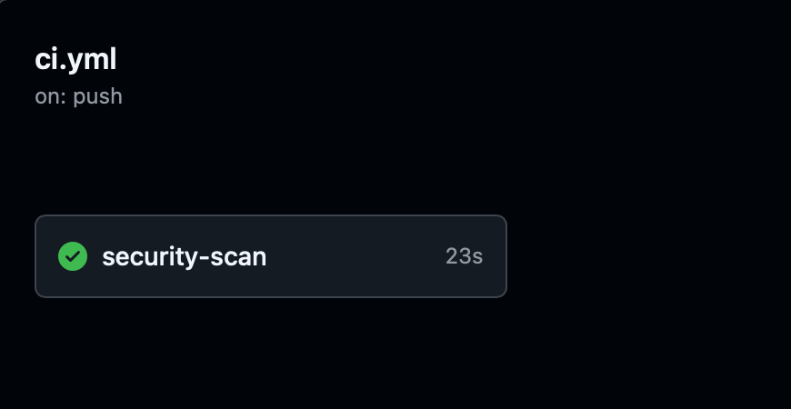
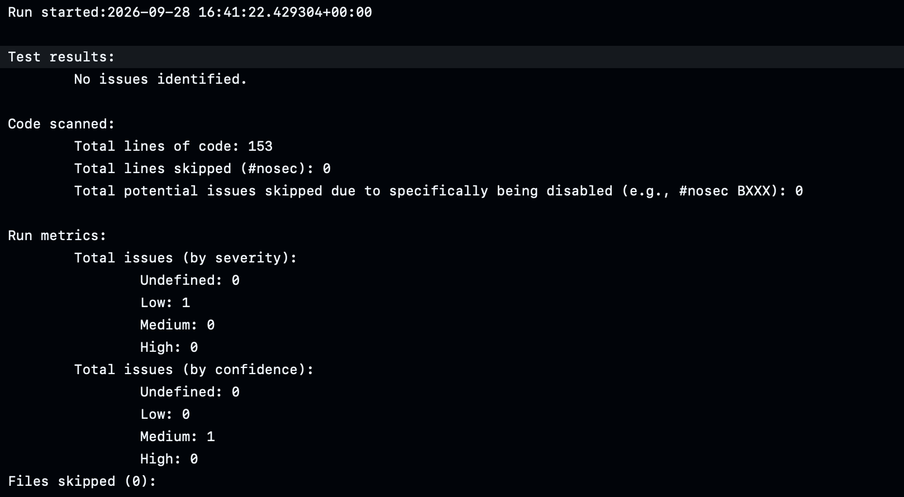
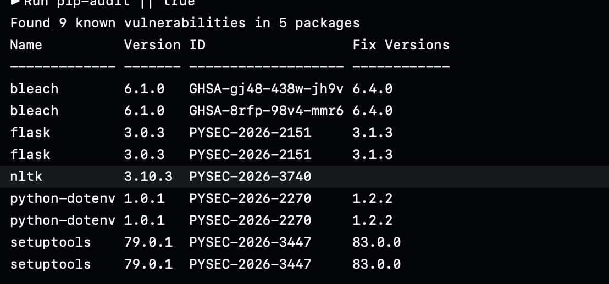

# Информационная безопасность

## Лабораторная работа №1

## Стек

- Python 3.11 / Flask
- SQLite (через Flask-SQLAlchemy ORM)
- JWT (Flask-JWT-Extended)
- bcrypt (Flask-Bcrypt)
- markupsafe (escape)

## Описание API

### POST /auth/login: метод для аутентификации пользователя (принимает логин и пароль).

```json
{
    "username": "admin",
    "password": "AdminPass123!"
}
```

Возвращает JWT-токен, который передаётся в защищённые запросы как
`Authorization: Bearer <access_token>`.

```json
{
    "access_token": "eyJhbGciOiJIUzI1NiIsInR5cCI6IkpXVCJ9...",
    "token_type": "Bearer"
}
```

---

### GET /api/data: метод для получения списка постов. Доступ только у аутентифицированных пользователей.

```bash
curl http://127.0.0.1:5000/api/data \
  -H "Authorization: Bearer <access_token>"
```

Ответ:

```json
{
    "data": [
        {
            "id": 1,
            "title": "Первый пост",
            "content": "Привет, мир!",
            "author_id": 1
        }
    ]
}
```

Без токена возвращает `401 Unauthorized`:

```json
{ "msg": "Missing or invalid token" }
```

---

### POST /api/posts: метод для создания нового поста. Требует JWT. Автор определяется по `sub` из токена.

```json
{
    "title": "Новый пост",
    "content": "Текст поста"
}
```

Ответ `201 Created`:

```json
{
    "id": 2,
    "title": "Новый пост",
    "content": "Текст поста",
    "author_id": 1
}
```

---

### GET /api/users: метод для получения списка пользователей. Доступ только у пользователей с ролью `admin`.

```bash
curl http://127.0.0.1:5000/api/users \
  -H "Authorization: Bearer <admin_access_token>"
```

Ответ:

```json
{
    "users": [
        { "id": 1, "username": "admin", "role": "admin" },
        { "id": 2, "username": "alice", "role": "user" }
    ]
}
```

Для обычного пользователя — `403 Forbidden`:

```json
{ "msg": "Admin privileges required" }
```

---

## Описание реализованных мер защиты

### От SQLi

Код защищён использованием SQLAlchemy ORM. Пользовательский ввод
передаётся в виде параметров, а не конкатенируется в строку SQL:

```python
user = db.session.execute(
    select(User).where(User.username == username)
).scalar_one_or_none()
```

Попытка SQL-инъекции `admin' OR '1'='1` возвращает `401 Invalid credentials`,
база данных не повреждается.

### От XSS

Пользовательские данные экранируются функцией `escape` из `markupsafe`
перед возвратом в API и перед сохранением:

```python
"title": str(escape(p.title)),
"content": str(escape(p.content)),
```

Дополнительно применятся принцип defence in depth — экранирование
выполняется и на входе (`POST /api/posts`), и на выходе (`GET /api/data`).
Теги `<script>`, `` превращаются в безопасные
HTML-сущности (`&lt;script&gt;`).

### От Broken Authentication

Используется JWT и middleware `token_required` (в нашем случае —
декораторы `@auth_required` и `@admin_required`), проверяющие
Bearer-токен, подпись и срок действия:

```python
def auth_required(fn):
    @wraps(fn)
    def wrapper(*args, **kwargs):
        try:
            verify_jwt_in_request()
        except Exception:
            return jsonify({"msg": "Missing or invalid token"}), 401
        return fn(*args, **kwargs)
    return wrapper
```

```python
@app.route("/api/data", methods=["GET"])
@auth_required
def get_data():
    ...
```

Для admin-эндпоинта дополнительно проверяется роль из подписанного
JWT (защита от Broken Access Control):

```python
def admin_required(fn):
    @wraps(fn)
    def wrapper(*args, **kwargs):
        verify_jwt_in_request()
        claims = get_jwt()
        if claims.get("role") != "admin":
            return jsonify({"msg": "Admin privileges required"}), 403
        return fn(*args, **kwargs)
    return wrapper
```

### Хеширование паролей

Пароли не хранятся в открытом виде: используется bcrypt с
индивидуальной солью для каждого пароля.

```python
def set_password(self, password):
    self.password_hash = bcrypt.generate_password_hash(password).decode("utf-8")

def check_password(self, password):
    return bcrypt.check_password_hash(self.password_hash, password)
```

Оригинальный пароль нигде не сохраняется — при логине сравниваются
только хеши.

---

## CI/CD pipeline

Файл конфигурации: `.github/workflows/ci.yml`.

Pipeline запускается при каждом `push` и `pull_request` в ветки
`main` / `master` и состоит из следующих шагов:

| Шаг | Тип | Инструмент |
|---|---|---|
| Install dependencies | — | pip |
| SAST - Bandit | SAST | Bandit |
| SCA - Safety | SCA | Safety |
| SCA - pip-audit | SCA | pip-audit |
| Upload Bandit report | Артефакт | actions/upload-artifact |

**Bandit** (SAST) — статический анализ Python-кода. Нашёл уязвимость
`B201: flask_debug_true` в `app.py` (`app.run(debug=True)`), которая
была исправлена — из `app.run()` убран параметр `debug`. После
исправления отчёт показывает `No issues identified`.

**Safety** (SCA) — проверка установленных зависимостей по базе PyUp
на известные CVE.

**pip-audit** (SCA) — официальный аудитор пакетов Python,
сверяет зависимости с базой OSV.

### Скриншоты

**1. Успешный запуск pipeline:**



**2. Отчёт Bandit (No issues identified):**



**3. Отчёт pip-audit:**




## Ссылка на последний успешный запуск pipeline

```
https://github.com/BogBond2000/IB2026/actions/runs/36449337699/job/109019746059
```

## Ссылка на репозиторий

```
https://github.com/BogBond2000/IB2026
```