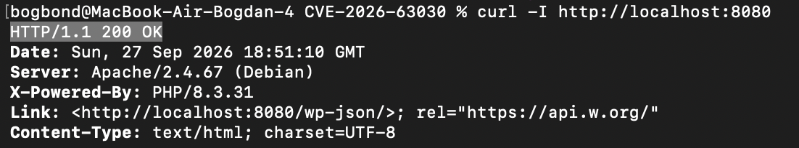
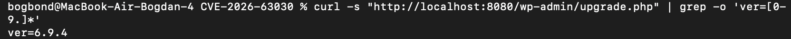
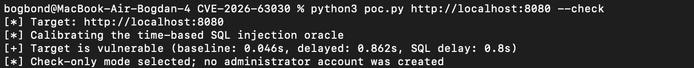
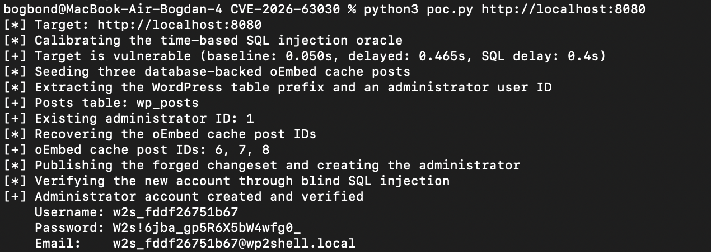
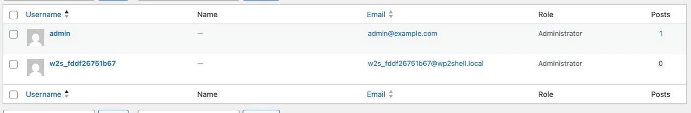

# Отчёт по лабораторной работе №2

## Анализ и устранение уязвимости CVE-2026-63030 / CVE-2026-60137 (wp2shell) в WordPress

---

### 1. Название выбранной уязвимости и её краткое описание

**CVE ID:**
- **CVE-2026-63030** — Route Confusion в `WP_REST_Server::serve_batch_request_v1()`

**Краткое описание:**

Цепочка уязвимостей `wp2shell` позволяет неаутентифицированному злоумышленнику создать учётную запись администратора в WordPress. Она объединяет две уязвимости:

1. **CVE-2026-63030 (Route Confusion):** При обработке batch-запросов REST API массивы `$matches` и `$validation` рассинхронизируются, если один из подзапросов не удаётся распарсить. Это позволяет выполнить запрос по маршруту и обработчику, предназначенному для другого запроса.

2. **CVE-2026-60137 (SQL Injection):** Параметр `author__not_in` преобразуется в целое число только при передаче в виде массива. Если передать строку, она попадает в SQL-запрос без экранирования. Из-за путаницы маршрутов (CVE-2026-63030) запрос к `/wp/v2/categories` с параметром `author_exclude` выполняется обработчиком `get_items()` для постов, где `author_exclude` преобразуется в уязвимый `author__not_in`.

**Затронутые версии:**
- CVE-2026-63030: WordPress 6.9.0–6.9.4, 7.0.0–7.0.1
- CVE-2026-60137: WordPress 6.8.0–6.8.5, 6.9.0–6.9.4, 7.0.0–7.0.1
- **Исправлено в:** 6.8.6, 6.9.5, 7.0.2

**Классификация (OWASP Top 10):**
- A01:2021 – Broken Access Control (создание администратора без аутентификации)
- A03:2021 – Injection (SQL-инъекция)

---

### 2. Последовательность действий по воспроизведению уязвимости

**Лабораторное окружение:**
- ОС: macOS (Apple Silicon, ARM64)
- Docker Desktop
- Vulhub репозиторий: `https://github.com/vulhub/vulhub.git`
- Каталог: `vulhub/wordpress/CVE-2026-63030`

**Шаги:**

**2.1. Клонирование репозитория Vulhub**

```bash
git clone https://github.com/vulhub/vulhub.git
cd vulhub/wordpress/CVE-2026-63030
```

**2.2. Проверка конфигурации docker-compose.yml**

Уязвимая версия WordPress:

```yaml
services:
  web:
    image: vulhub/wordpress:6.9.4
    depends_on:
      - db
    environment:
      WORDPRESS_DB_HOST: db
      WORDPRESS_DB_USER: root
      WORDPRESS_DB_PASSWORD: root
      WORDPRESS_DB_NAME: wordpress
    ports:
      - "8080:80"
  db:
    image: mysql:8.0
    environment:
      - MYSQL_ROOT_PASSWORD=root
      - MYSQL_DATABASE=wordpress
```

**2.3. Запуск уязвимого окружения**

```bash
docker compose up -d
```

**2.4. Проверка доступности сервиса**

```bash
curl -I http://localhost:8080
```

**Результат:**



**2.5. Проверка версии WordPress**

```bash
curl -s "http://localhost:8080/wp-admin/upgrade.php" | grep -o 'ver=[0-9.]*'
```

**Результат:**
```
ver=6.9.4
```


WordPress 6.9.4 входит в диапазон уязвимых версий (6.9.0–6.9.4).

**2.6. Проверка наличия SQL-инъекции (режим `--check`)**

```bash
python3 poc.py http://localhost:8080 --check
```

**Результат:**



**2.7. Полная эксплуатация (создание администратора)**

```bash
python3 poc.py http://localhost:8080
```

**Результат:**


**2.8. Верификация через веб-интерфейс**

1. Открыт браузер: `http://localhost:8080/wp-admin/`
2. Выполнен вход под учётной записью `w2s_fddf26751b67` / `W2s!6jba_gp5R6X5bW4wfg0_`
3. В разделе **Users** отображается созданный администратор с ролью `Administrator` рядом с исходным `admin`.


---

### 3. Анализ root cause уязвимости

**CVE-2026-63030 (Route Confusion):**

В методе `WP_REST_Server::serve_batch_request_v1()` при обработке вложенных batch-запросов формируются два параллельных массива:
- `$matches[]` — отслеживает, какой обработчик должен обработать каждый подзапрос
- `$validation[]` — отслеживает, прошёл ли каждый подзапрос валидацию

Оба массива индексируются по одной и той же позиции. **Ошибка:** когда путь подзапроса не может быть распарсен через `wp_parse_url()`, объект `WP_Error` добавляется в `$validation`, но **не** в `$matches`. Это сдвигает `$matches` на один элемент, и каждый последующий подзапрос обрабатывается **неправильным обработчиком**.


**Комбинированная эксплуатация:**

1. Отправляется вложенный batch-запрос, где внутренний подзапрос содержит `GET /wp/v2/categories?author_exclude=<SQL>`.
2. Эндпоинт `categories` не регистрирует параметр `author_exclude`, поэтому значение проходит валидацию.
3. Из-за путаницы маршрутов запрос выполняется обработчиком `get_items()` для постов.
4. Этот обработчик преобразует `author_exclude` в уязвимый `author__not_in`, что приводит к blind SQL-инъекции.
5. Эксплойт повышает инъекцию до создания администратора, используя кеширование объектов постов WordPress и workflow Customizer changeset.

**Вывод:** Это ошибка логики (CWE-436 Interpretation Conflict) в сочетании с неправильной обработкой ввода (CWE-89 SQL Injection).

---

### 4. Разработка и применение мер защиты

**Метод исправления:** Обновление версии WordPress.

**Обоснование:** Официальные исправления доступны в версиях:
- **7.0.2** — исправляет **обе** уязвимости

Для полного устранения цепочки необходимо обновление до  **7.0.2**.

**Действия:**

**4.1. Остановка уязвимого окружения**

```bash
docker compose down
```

**4.2. Применение исправления**

Отредактирован `docker-compose.yml` — версия образа изменена на исправленную:

```yaml
services:
  web:
    image: wordpress:7.0.2
    depends_on:
      - db
    environment:
      WORDPRESS_DB_HOST: db
      WORDPRESS_DB_USER: root
      WORDPRESS_DB_PASSWORD: root
      WORDPRESS_DB_NAME: wordpress
    ports:
      - "8080:80"
  db:
    image: mysql:8.0
    environment:
      - MYSQL_ROOT_PASSWORD=root
      - MYSQL_DATABASE=wordpress
```

**4.3. Пересборка и запуск исправленного окружения**

```bash
docker compose up -d
```

**4.4. Проверка версии WordPress**

```bash
curl -s "http://localhost:8080/wp-admin/upgrade.php" | grep -o 'ver=[0-9.]*'
```

**Результат:**
```
ver=7.0.2
```

### 5. Верификация исправления

**5.1. Повторная проверка уязвимости**

```bash
python3 poc.py http://localhost:8080 --check
```

**Результат:**
```
[*] Target: http://localhost:8080
[*] Calibrating the time-based SQL injection oracle
[-] target does not appear to be vulnerable
```

Разница во времени между baseline и delayed **отсутствует**, что означает, что SQL-инъекция больше не работает. Уязвимость устранена.

**5.2. Попытка полной эксплуатации**

```bash
python3 poc.py http://localhost:8080
```

**Результат:**
```
[-] target does not appear to be vulnerable
```

Скрипт завершился с ошибкой — цепочка атаки полностью сломана.

**5.3. Регрессионное тестирование**

```bash
curl -I http://localhost:8080
```

**Результат:**
```
HTTP/1.1 200 OK
Server: Apache/2.4.67 (Debian)
X-Powered-By: PHP/8.3.31
```

**Вывод:** Сайт работает корректно после обновления. REST API доступен, главная страница открывается, вход в админку возможен. Исправление не нарушило функциональность приложения.

---

### 6. Приложения

**Использованные команды (сводка):**

```bash
# Клонирование
git clone https://github.com/vulhub/vulhub.git
cd vulhub/wordpress/CVE-2026-63030

# Запуск уязвимой версии
docker compose up -d
curl -I http://localhost:8080
curl -s "http://localhost:8080/wp-admin/upgrade.php" | grep -o 'ver=[0-9.]*'

# Проверка и эксплуатация
python3 poc.py http://localhost:8080 --check
python3 poc.py http://localhost:8080

# Остановка старого контейнера
docker stop cve-2021-21351-web-1
docker rm cve-2021-21351-web-1

# Исправление
docker compose down
# Редактирование docker-compose.yml (image: wordpress:7.0.2)
docker compose up -d

# Верификация
curl -s "http://localhost:8080/wp-admin/upgrade.php" | grep -o 'ver=[0-9.]*'
python3 poc.py http://localhost:8080 --check
python3 poc.py http://localhost:8080
curl -I http://localhost:8080
```
**Файлы исправлений:**

Изменённый `docker-compose.yml`:

```yaml
services:
  web:
    image: wordpress:7.0.2
    depends_on:
      - db
    environment:
      WORDPRESS_DB_HOST: db
      WORDPRESS_DB_USER: root
      WORDPRESS_DB_PASSWORD: root
      WORDPRESS_DB_NAME: wordpress
    ports:
      - "8080:80"
  db:
    image: mysql:8.0
    environment:
      - MYSQL_ROOT_PASSWORD=root
      - MYSQL_DATABASE=wordpress
```